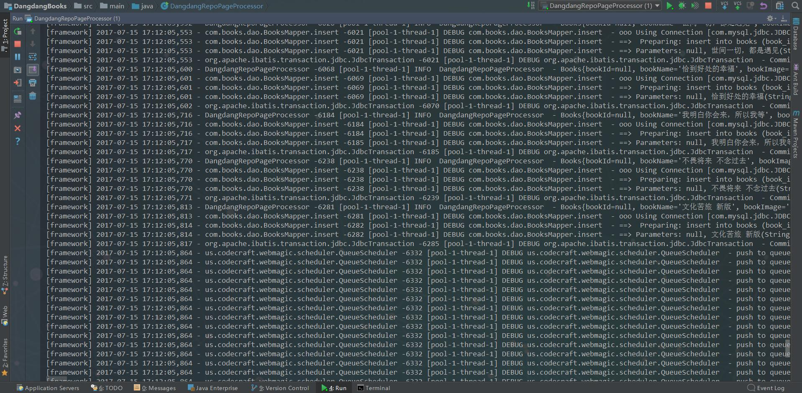
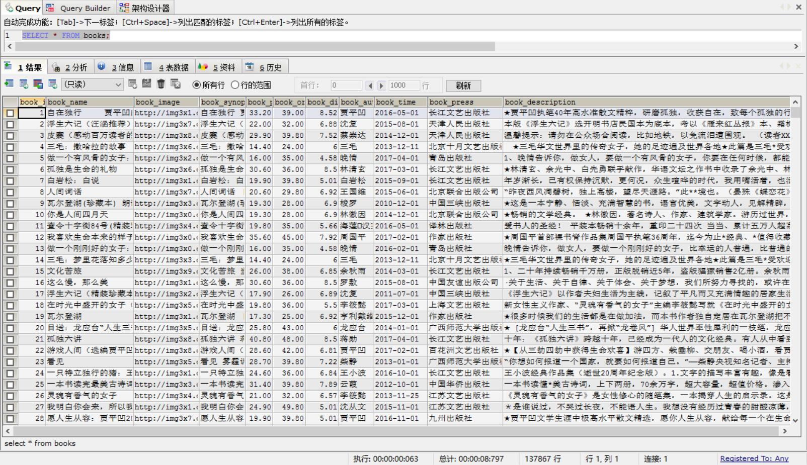

# DangdangBooks
## 简介
基于WebMagic + Mybatis框架进行开发，对当当网图书信息页面进行抓取并抽取关键信息保存到数据库。

### 组织结构

	dangdangbooks 
	├── src
	|    ├── main 
	|    |    |—— java 
	|    | 	  |    |——com.books.constant 页面解析的全局节点配置
	|    |    |    |——com.books.dao --操作数据表方法及映射文件
	|    |    |    |——com.books.model -- 数据表对应实体类
	|    |    |    |——com.books.services -- 图书数据保存方法定义接口
	|    |    |    |——com.books.services.impl -- 图书数据保存方法定义实现类
	|    |    ├── resources -- log4j 及 mybatis配置文件
	|    |    ├── webapp-- 网站前台（暂无页面）
	|    ├── sql -- Mysql 建表代码 
	|____├── test -- 测试代码
	
### 使用事项
>
 * 此项目是在 JDK 8 环境下使用 IDEA 进行开发，推荐使用 IDEA 进行导入 
 * 使用前请先将 src 下<code>sql</code>目录中的代码放入Mysql 数据库中执行，并修改 src -> main -> resources 中的 mybaits-config.xml 数据库连接相关信息

  * 程序入口是 src -> mian -> java 下的<code>DangdangRepoPageProcessor</code> 类，数据库配置完成之后直接执行<code>main</code> 方法即可
 
 * 页面解析是使用 <code>XPath</code> 语法进行关键字抽取，所以会出现部分页面匹配不上的问题，控制台会抛出<code>NullPointerException</code>,不过不用担心，已经做出相的应异常处理，程序不会因为抛出异常而终止。
 
 * 由于当当网图书信息量巨大，所以程序会运行比较长一段时间，具体时间视使用环境而定，有可能会在网速不好的情况下出现抓取数据量不一致。程序正常终止时，数据量稳定达到10W 及以上。
 
### 效果图

### 推荐阅读
- [WebMagic 中文在线文档](http://webmagic.io/docs/zh/)
- [MyBatis 中文在线文档](http://www.mybatis.org/mybatis-3/zh/index.html)

